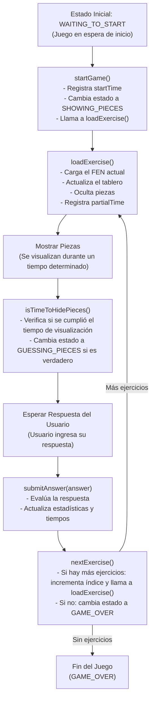

# Diagrama de Flujo del Juego de Memoria

El siguiente diagrama de flujo describe el ciclo de vida de un juego de memoria basado en la clase `MemoryGame`.

* Estado Inicial (WAITING_TO_START):
El juego comienza en un estado de espera. Se inicia al llamar a startGame().
* startGame():
	•	Registra el tiempo de inicio.
	•	Cambia el estado a SHOWING_PIECES.
	•	Invoca loadExercise() para cargar el primer ejercicio.
* loadExercise():
	•	Selecciona el FEN correspondiente al ejercicio actual.
	•	Actualiza el tablero y oculta las piezas según la lógica del juego.
	•	Registra el tiempo parcial (partialTime).
* Mostrar Piezas:
 Se muestran las piezas en el tablero durante un tiempo predefinido, permitiendo al usuario memorizarlas.
* isTimeToHidePieces():
	•	Verifica si el tiempo de visualización ha transcurrido.
	•	Si es así, cambia el estado a GUESSING_PIECES para que el usuario pueda enviar su respuesta.
* Esperar Respuesta del Usuario:
El juego espera que el usuario ingrese su respuesta (por ejemplo, adivinar las piezas ocultas o introducir un movimiento).
* submitAnswer(answer):
	•	Evalúa la respuesta recibida.
	•	Actualiza las estadísticas y tiempos del juego.
	•	La respuesta puede ser de diferentes tipos, según el juego.
* nextExercise():
	•	Si existen más ejercicios, incrementa el índice y vuelve a cargar el siguiente ejercicio.
	•	Si no hay más ejercicios, cambia el estado a GAME_OVER.
* Fin del Juego (GAME_OVER):
Se alcanza cuando ya no hay más ejercicios disponibles, finalizando el ciclo del juego.